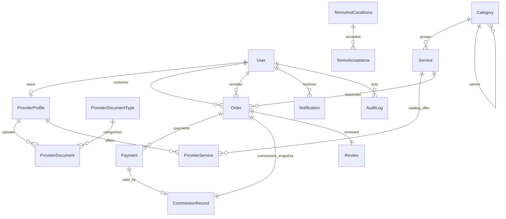

# Service Marketplace ERD

```mermaid
erDiagram
  User ||--o| ProviderProfile : owns
  ProviderProfile ||--o{ ProviderDocument : uploads
  ProviderDocumentType ||--o{ ProviderDocument : categorizes
  Category ||--o{ Service : groups
  Category ||--o{ Category : parent
  Service ||--o{ ProviderService : catalog_offer
  ProviderProfile ||--o{ ProviderService : offers
  User ||--o{ Order : customer
  User ||--o{ Order : provider
  Service ||--o{ Order : requested
  Order ||--o{ Payment : payments
  Order ||--|| CommissionRecord : commission_snapshot
  Payment ||--o| CommissionRecord : paid_by
  Order ||--|| Review : reviewed
  TermsAndConditions ||--o{ TermsAcceptance : accepted
  User ||--o{ Notification : receives
  User ||--o{ AuditLog : acts
```

Payment gateways, maps, email, and push providers are extension points and need external configuration for real integrations.
